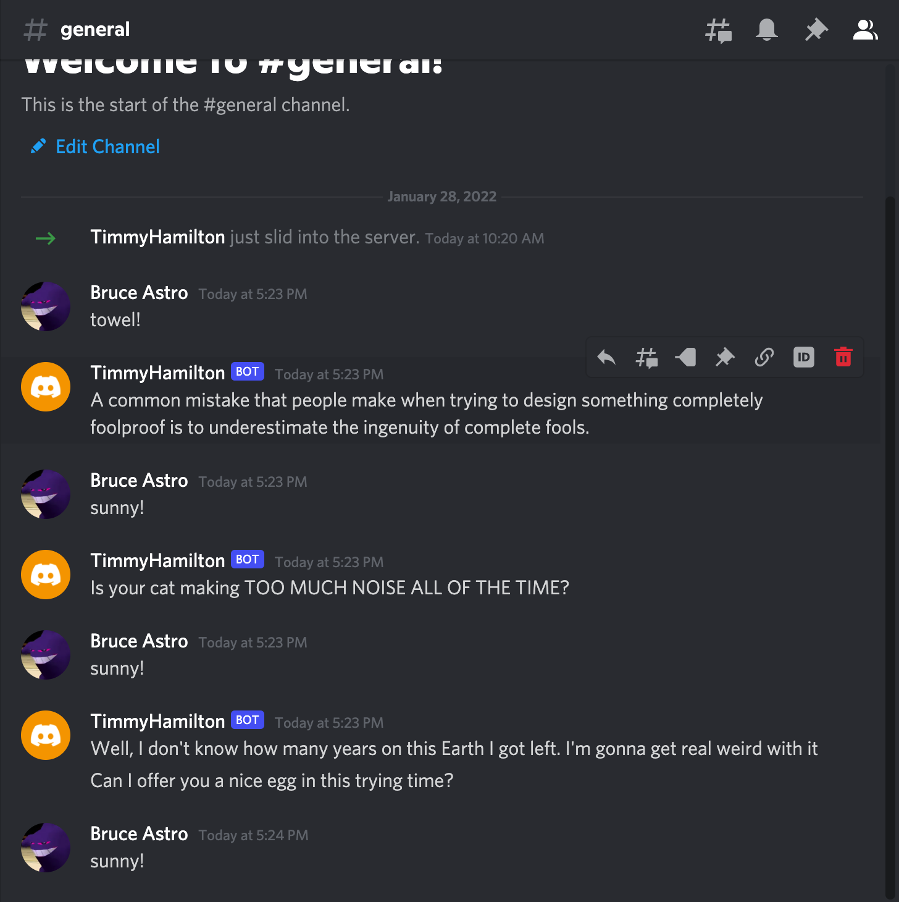

# Project 1 - Discord Bot
#### Setup
##### * Recieving an API token
The API token from discord can be copied from the [developer page](https://discord.com/developers/applications) where you created your bot. From that page, click the application your bot is under and click the bot tab on the left menu. Near the top of the page you will see "Reveal token" along with a conveinient way to copy to clipboard.
##### * Where to keep API tokens
API tokens should be kept in an .env file within the same directory as the bot's python level itself. To protect this token, make sure that .env is added to .gitignore so that the token is not pushed to the public internet.
##### * Dependencies
The bot requires **Python 3** to run. In addition, the following packages need to be installed to run (through pip3):
###### *    Discord.py
pip3 install -U discord.py
###### *    dotenv
pip3 install -U dotenv

#### Usage
This Discord bot has 2 very simple commands:
##### towel!
* Came with the code. After sending the command to a server with an active bot, the bot will reply with a quote from Hitchhiker's Guide to the Galaxy selected at random.
##### sunny!
* Similar to **towel!**, once the command is sent the bot will reply with a quote from It's Always Sunny in Philidelphia also chosen at random.
##### Example:

#### Research
While it is very lame that this spectacular and useful bot can only be used when the terminal runs it, there are other solutions! There are several web hosts for bots, including AWS, that will provide uptime 24/7 for a very affordable cost. Additionally, if you're extra crafty, a Raspberry Pi can be constructed to host a bot as well.