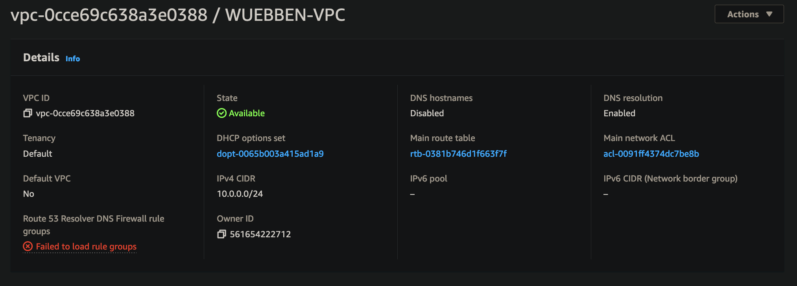
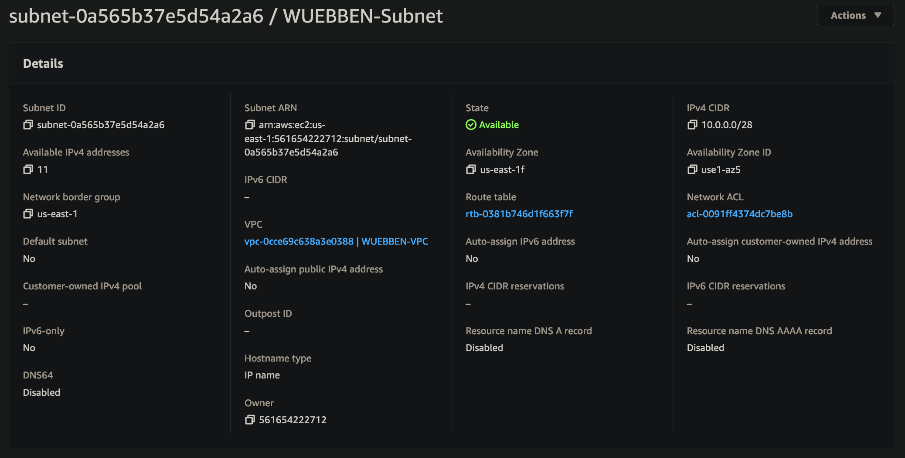
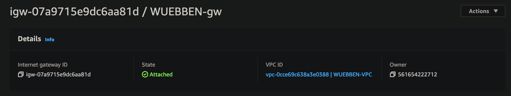
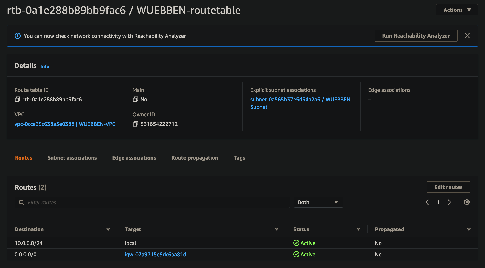
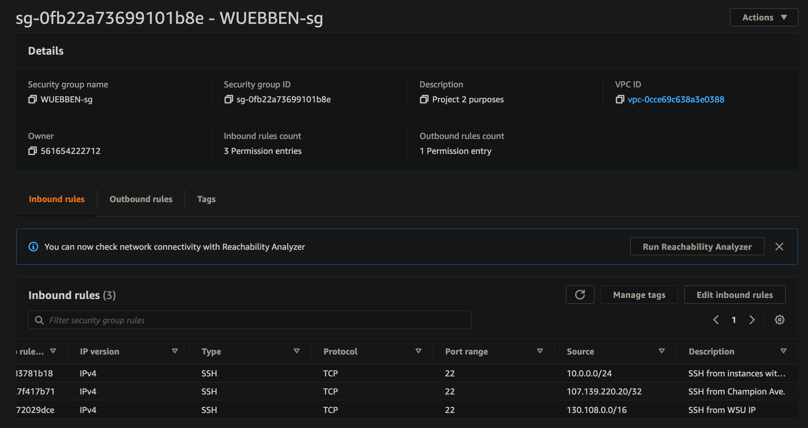
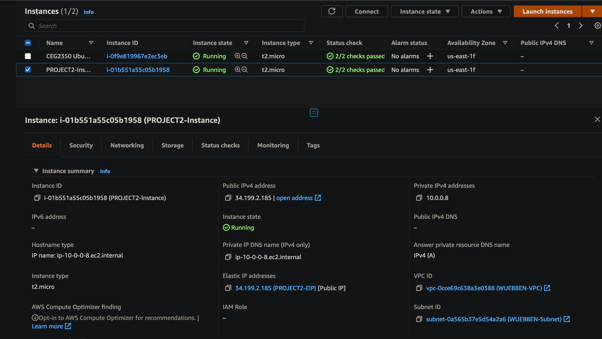
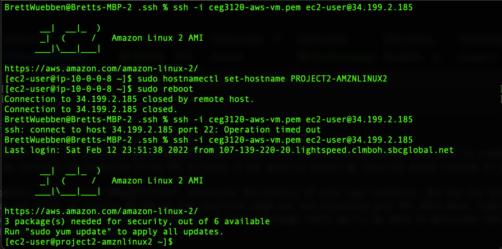

# PROJECT 2
### PART 1 - Build a VPC
1. Create a VPC
    * Tag it with "PROJECT2-VPC"
    * Specify a /24 private IP address range
    

2. Create a subnet
    * Tag it with "PROJECT2-Subnet"
    * Specify a /28 private IP address range
    * Attach it to your VPC
    

3. Create an internet gateway
    * Tag it with "PROJECT2-gw"
    * Attach it to your VPC
    

4. Create a route table
    * Tag it with "PROJECT2-routetable"
    * Attach it to your VPC
    * Associate it with your subnet
    * Add a routing table rule that sends traffic to all destination to your internet gateway
    

5. Create a security group
    * Tag it with "PROJECT2-sg"
    * Allow SSH for a set of trusted networks including:
        * Your home/where you sually connect to your instances from
        * Wright State (addresses starting with 130.108)
        * Instances within the VPC
    * Attach it to your VPC
    * Image should include your Inbound rules
    

### PART 2 - EC2 instances
1. Create a new instance. Give a write up of the following:
    * AMI selected: Amazon Linux 2
        * username: ec2-user
    * Instance type selected: t2.micro

2. Attach the instance to your VPC. As discussed there are different pathways to doing this. Say how you did it
    * Using the wizard, on step 3 I selected my vpc from the network drop down selection

3. Determine whether a Public IPv4 address will be auto-assigned to the instance. Justify your choice to do so (or not do so)
    * I chose to disable the auto assigned public IPv4 address. Reasons being that I wouldn't want to go back and reconfigure if Amazon were to take it from me in the case of someone else purchasing it. Second, since an elastic IP needs to be configured later in the project anyway.

4. Attach a volume to your instance. As discussed there are different pathways to doing this Say how you did it. 
    * Continuing in the wizard, Step 4 allows you to add new volumes as needed

5. Tag your instance with a "Name" of "PROJECT2-instance". Say how you did it.
    * Step 5 of the creation wizard allows you to create and add tags to your instance. I created a "Name" tag and gave it the required name

6. Assocaite your security group, "PROJECT2-sg" to your instance. Say how you did it.
    * Step 6 of the wizard deals with the security group options. One of the first selections is whether you want to create a new group or use an existing. Since my instance is connected to my VPC already, I was able to select my security group created in part 1

7. Reserve an Elastic IP address. Tag it with "PROJECT2-EIP". Assoicate the Elastic IP with your instance. Say how you did it. 
    * On the left side menu, you click on elastic IP and on the resulting page you can allocated your IP. Once done, highlight the EIP and click actions where you'll see "associate elastic ip address". Clicking through there you'll be able to associate the elastic IP as well as claim the private IP the instance is using.

8. Create a screnshot your instance details and add it to your project write up.
    

9. ssh in to your instance. Change the hostname to "PROJECT2-AMI" where AMI is some version of the AMI you chose. Say how you did it.
    * Once I ssh'd into the system, I used the hostnamectl as the root user and specified the name I wanted (PROJECT2-AMZNLINUX2). I then rebooted the system and logged back in to verify the hostname change

10. Create a screenshot your ssh connection to your instance and add it to your project write up - make sure it shows your new hostname
    