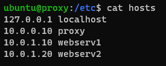
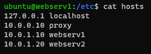
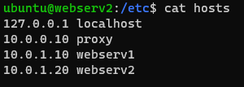
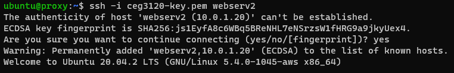
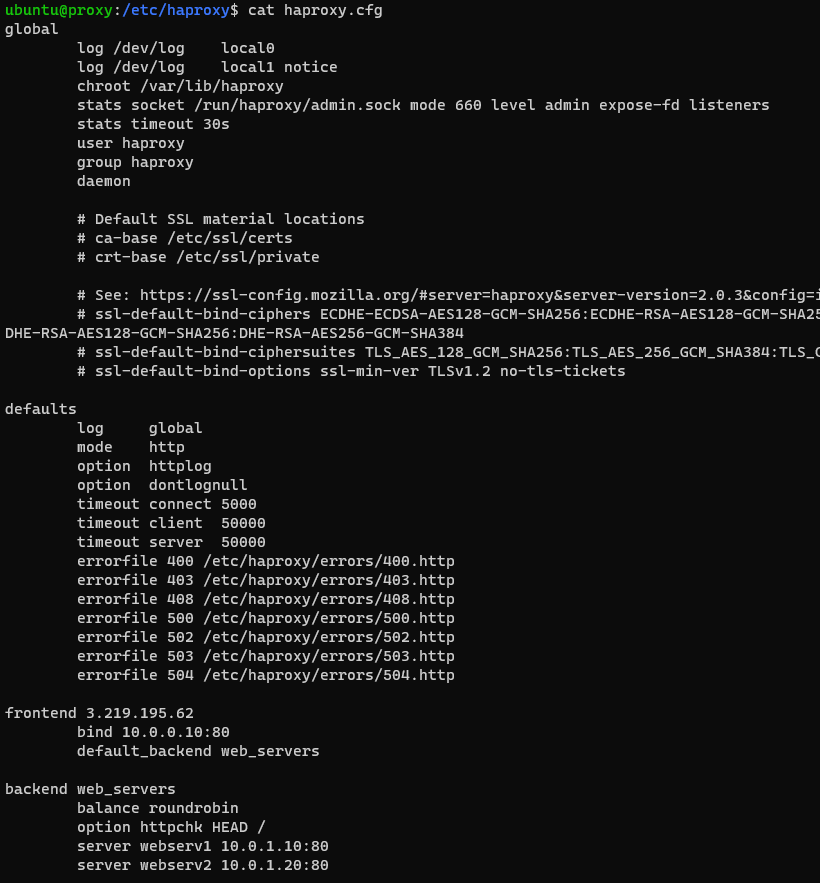
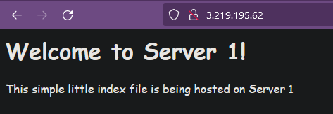
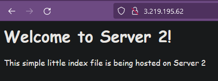

# Project 4
## 1. Create an /etc/hosts OR .ssh/config file on each system that correlates hostnames to private IPs.
   ### Proxy /etc/hosts
   
   ### Webserv1 /etc/hosts
   
   ### Webserv2 /etc/hosts
   
   ### Description of how file is configured
   - As root user, open up the hosts file in a text editor and add your private IPs followed by your chosen hostname into the file (seen in the screenshots above)

## 2. Document how to SSH in between the systems utilizing their private IPs.
   - `ssh -i [keyfile] [hostname]`
  
   

## 3. HAProxy config & documentation requirements
   ### What files were modified & their location
   - `/etc/haproxy/haproxy.cfg`
   - Made a copy of haproxy.cfg called haproxy.cfg.bak
   ### What configurations were set
   - 
   ### How to restart the service after a configuration change
   - `sudo systemctl restart haproxy`
   ### resources used (websites)
   - [The Four Essential Sections of an HAProxy Configuration](https://www.haproxy.com/blog/the-four-essential-sections-of-an-haproxy-configuration/)

## 4. Webserver 1 & 2 configuration & documentation requirements
   ### What files were modified & their location
   - For each webserver:
     - `/var/www/html/index.html`
     - A backup was created in the same directory of each titled index.html.bkup
   ### What configurations were set
   - No new configurations were set for Apache, the index files were edited to display the pages seen in screenshots shown in step 5
   ### Where site content files were located and why
   - `/var/www/html`
   - The apache configuration file specifies that directory as a default for site content
   ### How to restart the service after a configuration change
   - ` sudo systemctl restart apache2 `
   ### resources used (websites)
   - None outside of lecture recordings

## 5. From the browser, when connecting to the proxy server, take two screenshots
   ### Webserver 1
   
   ### Webserver 2
   
